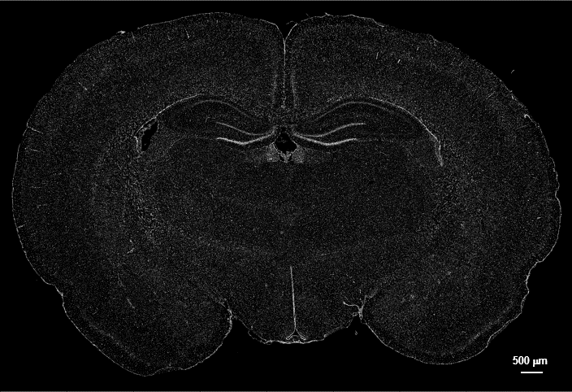
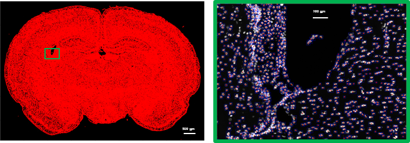
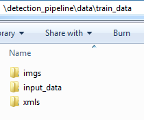
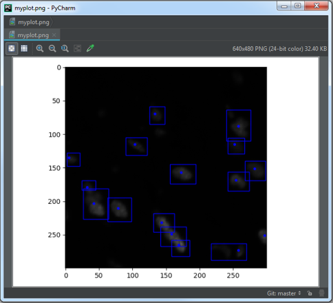
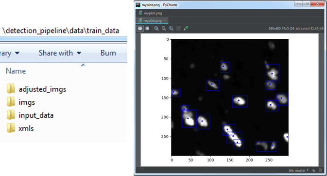
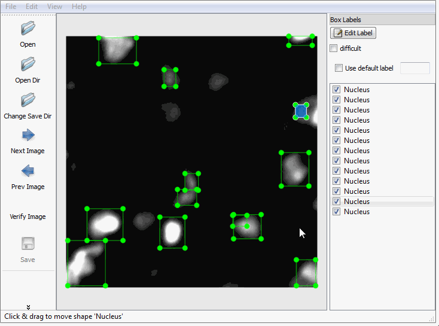

# detection_pipeline:

detection_pipeline is a tool for cell detection in large biomedical images with nuclei stained biomarker.



Our goal is to perform large scale cell detection in an accurate and rubost manner.



# Dependencies:

* Tensorflow v1.4.* or later!

* [Protobuf](https://github.com/google/protobuf/releases)

# Installation:
  1. Download Protobuf from [here]((https://github.com/google/protobuf/releases) and run the following command from ```lib``` directory:
  ``` bash
  protoc object_detection/protos/*.proto --python_out=.
  ```
  __*NOTE:__ Make sure the executable folder is added to your path variable:

  (__for Windows__):
  ```
  # From Protoc*/bin
  SET PATH=%PATH%;%cd%
  ```

  (__for Linux and Mac__):
  ```bash
  # From Protoc*/bin
  export PATH=$PATH:`pwd`
  ```


# Pipeline:

### 1. Create small crops from large images and centers:
In order to train our model, we have to create small crops from the large image.
```write_crops.py``` read your large image and corresponding seeds from ```data/input_data``` directory and creates small crops
 with size ```crop_size``` and save crops and xml files in ```imgs``` and ```xmls``` folders in ```save_dir``` folder.
```bash
python write_crops.py --images_dir=data/train_data/input_data --crop_size=300,300 --save_dir=data/train_data --adjust_image --visualize=2
```


 - You can use visualize if you want to see the first "n" crops to make sure everything is right.
 
 - You can adjust the intensity of the image __for visualization__ using ```--image_adjust```.
 It will also create a new folder with intensity adjusted crops as ```adjusted_imgs```.
 


### 2. (optional) Fix bounding boxes using [LabelImg](https://github.com/tzutalin/labelImg)
You can use [LabelImg](https://github.com/tzutalin/labelImg) software to correct the bounding boxes.
 

### 3. Generate tfrecord file from xmls and imgs
After you created the crop images and corresponding xml files, you can generated the ```tfrecord``` file.
```tfrecord``` file is the input to your network.
```bash
python generate_tfrecord.py --input_dir=data/train_data --output_path=data/train_data/train.record
```
Create a label map for mapping classes to unique IDs. Create a ```nucleus_map.pbtxt``` file inside ```data``` folder and add following lines:
```vim
item {
name: "Nucleus"
id: 1
display_name: "Nucleus"
}
```

### 4. Train:
1. Download your pretrained model from [here](https://github.com/tensorflow/models/blob/master/research/object_detection/g3doc/detection_model_zoo.md) and save it in folder ```pretrained_models ```.

2. create a __training__ folder to save the training model and parameters. Inside the __training__ folder copy the .config file from ```lib/object_detection/samples/configs/```.
For example ```faster_rcnn_inception_resnet_v2_atrous_coco.config``` file.

edit the following lines:

```vim
num_classes: 1

image_resizer {
   fixed_shape_resizer {
     width: 300
     height: 300
   }
}

second_stage_post_processing {
  batch_non_max_suppression {
    score_threshold: 0.0
    iou_threshold: 0.6
    max_detections_per_class: 300
    max_total_detections: 300
  }

fine_tune_checkpoint: pretrained_models/faster_rcnn_inception_resnet_v2_atrous_coco_2018_01_28

input_path: data/train.record
label_map_path: data/nucleus_map.pbtxt
```

and comment the evaluation lines:

```vim
# eval_config: {
#   num_examples: 8000
#   # Note: The below line limits the evaluation process to 10 evaluations.
#   # Remove the below line to evaluate indefinitely.
#   max_evals: 10
# }
#
# eval_input_reader: {
#   tf_record_input_reader {
#   input_path: "PATH_TO_BE_CONFIGURED/mscoco_val.record"
# }
# label_map_path: "PATH_TO_BE_CONFIGURED/mscoco_label_map.pbtxt"
# shuffle: false
# num_readers: 1
# }
```

Now you can train your model:
```bash
python train.py --logtostderr --train_dir=training --pipeline_config_path=training/faster_rcnn_inception_resnet_v2_atrous_coco.config
```
  
### 5. Export Inference Graph:
After the training is done, you have to validate and test your network.```export_inference_graph``` freezes your model for testing.
Since we are using convolutional neural network, we can test larger images. So, we can create a new config file and change the size of the input image:
```vim
image_resizer {
   fixed_shape_resizer {
     width: 500
     height: 500
   }
}
```

Now we can freeze the model with new configuration.
```bash
python export_inference_graph.py --ipnut_type=image_tensor --pipeline_config_path=training/test.config --trained_checkpoint_prefix=training/model.ckpt-20000 --output_directory=freezed_model
```
__NOTE__: Make sure you have all 3 ```.index```,```.meta``` and ```.data``` files for that checkpoint.

### 6. Visualization Test:
1. Create ```test_image``` folder and put some sample images.
2. run ```test.ipynb``` in jupyter notebook.

### 7. Detect cells in large images:
After you are done with training and you checked your network works well, you can run the network on large images.
```bash
python predict.py --input_dir=data/large_image --crop_size=500,500
```

# Probable Errors:

1. If you faced this error:  
  ```bash
  ImportError: No module named 'object_detection'
  ```

  Add object_detection and slim folders to PYTHONPATH.  
  
  - (__for Windows__):
    ```bash
    # From tensorflow/models/research/
    SET PYTHONPATH=%cd%;%cd%\slim
    ```

  - (__for Linux and Mac__):
    ```bash
    # From tensorflow/models/research/
    export PYTHONPATH=$PYTHONPATH:`pwd`:`pwd`/slim
    ```

2. If your TensorFlow version is  < 1.5 you might have issues with object detection module. Go to commit 196d173 which is compatible with tf 1.4.1:

  ```bash
  # from tensorflwo/models
  git checkout 196d173
  ```

3. If your TensorFlow version is > 1.5 you might have compatibility issue with python3.x. If you faced the following error:
  ```bash
  ValueError: Tried to convert 't' to a tensor and failed. Error: Argument must be a dense tensor: range(0, 3) - got shape [3], but wanted [].
  ```
  In ```lib/object_detection/utils/learning_schedules.py``` lines 167-169, Wrap ```list()``` around the ```range()``` like this:
  ```python
  rate_index = tf.reduce_max(tf.where(tf.greater_equal(global_step, boundaries),
                                       list(range(num_boundaries)),
                                        [0] * num_boundaries))
  ```
  
4. If stucked with ```INFO:tensorflow:global_step/sec: 0``` you might have some issues with the ```.record``` data file. Double check your input data file.

5. If stucked with ``` Dst tensor is not initialized ``` your GPU memory is full. Try ```nvidia-smi``` to monitor your GPU usage and try ```kill #process_id``` to kill the process that uses the memory.